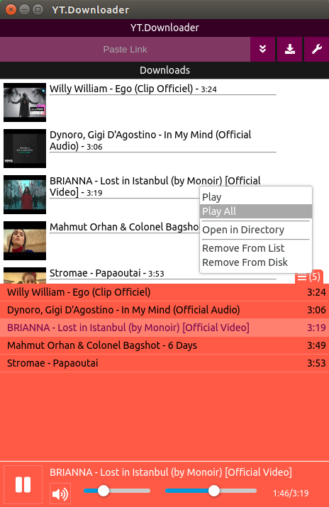

# YT.Downloader

> Youtube Video Downloader&Converter and Play Music


Fast Download and Convert to mp3.
Background: Electron and Vue
## Screenshot



## Next Version

* Context Menu Paste
* Detailed Download (Quality, Media Type [Video,Voice,Subtitle])
* Detailed Converter
* Fast Download Default Settings
* Run Background&Tray
* Notification
* Playlist Download
* Shuffle, Repeat for Music Player
* Multi Language Support
* MP3 file add meta info

#### Build Setup

``` bash
# install dependencies
npm install

# serve with hot reload at localhost:9080
npm run dev

# build electron application for production
npm run build


# lint all JS/Vue component files in `src/`
npm run lint

```

---

This project was generated with [electron-vue](https://github.com/SimulatedGREG/electron-vue)@[16fb2b9](https://github.com/SimulatedGREG/electron-vue/tree/16fb2b963f17318cd9ff17d2adfd1945bd7107a0) using [vue-cli](https://github.com/vuejs/vue-cli). Documentation about the original structure can be found [here](https://simulatedgreg.gitbooks.io/electron-vue/content/index.html).
